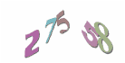
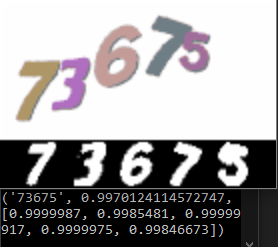

# Project Euler captcha solver
I found it weird that an ancient CAPTCHA method such as character recognition from an image is still used today, let alone on a website that is targeted at people who are good at programming and mathematics (and then me, lol). What is more, the images Project Euler generates seem to be particularly readable. Surely, I thought to myself, it cannot be too hard to write a program  to break it, especially given all those ready to use machine learning libraries that are available. Well, it wasn't.
A collection of training and testing data as well as a pretrained model are included.  
Current succes rate for solving a CAPTCHA is 90% and there's a potential for much higher rate - either by collectig more training data or by improving the preprocessing.  
**Example CAPTCHA**  


## Using the solver
Easiest way to use the solver is to take advantage of the pretrained model in the "model0" folder, this model has about 90% succes rate.
Example usage:
```
import pe_captcha
model = pe_captcha.load_model("model0")
picture = pe_captcha.load_picture(picture)   # loads picture from numpy array, url or local path
result = pe_captcha.solve(model, picture)
```

## How it works
The captcha always consists of exactly 5 decimal digits.
The solver works in two distinct steps:
1. locating and separating the digits,
2. using a neural network on individual digits to predict what they are.

### Locating and separating the digits

Often none of the 5 digits overlap. Here, we just convert the picture to B/W nad locate adjacent areas of black. It is common though, that there's a pair of digits that touches/overlaps (or a triple or two pairs is is the case above). In such a case we take advantage of the different colors (so being colorful is really a weakness rather than a strength).
We identify the most dominant colors in the picture and create masks based on it. We then try to overlap these masks with areas of adjacent nonwhite. If there's a large nonwhite overlap, we have a digit. Or at least some idea of where a digit is. To really use this information we dilate it (expand), take its convex hull and overlap *that* with the original picture. We also remove any pixels that were already used in the previous digit.  
We might get unlucky and this process might produce less than 5 characters (usually when two same color digits overlap).  
When this count is 4, we take the widest part and split it in half. If it is less we give up

### Neural network

Neural network is definied using a Keras library and uses convolution layers.

## Collecting training/testing data
One can collect testing data by calling
```
pe_captcha.collect_testing(model_name, old_model_name)
```
Both parameters can be omitted.  
New captchas are downloaded and shown to you. You can press 0-9 keys to mark what characters it contains.
If `existing_model` is provided, you can use its prediction instead of typing on your own by hitting the enter key.


To collect training data, call
```
pe_captcha.collect_training(model_name, old_model_name)
```
This works the same, except characters are separated and stored individually.

## Testing
Running
```
print(pe_captcha.test_from_disk(model_name))
```
tests the model on data in the given folder and prints a succes rate.

Running
```
pe_captcha.test_online(model_name)
```

Downloads new captcha and solves it. In the console it outputs the prediction and predicted probability of succes (total and for individual characters).
Repeats this until stopped.  

